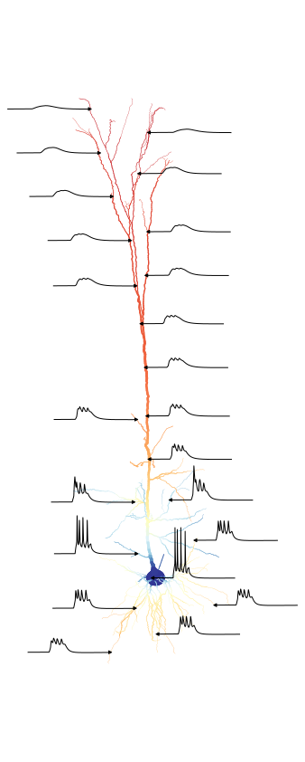

# Layer5Comparison

# Figure 4 comparison table:

Over 5 trials

| Simulator | Version           | Translator  | Timestep         | Run time (sim s / bio s) | Relative speed  |   |
|-----------|-------------------|-------------|------------------|--------------------------|-----------------|---|
| Arbor     | 0.8.1-dev (+SIMD) | nmlcc-super | 0.025            | 1.36                     | fastest         |   |
| Arbor     | 0.8.1-dev (+SIMD) | nmlcc       | 0.025            | 1.55                     | 14.220% slower  |   |
| Arbor     | 0.8.1-dev (+SIMD) | jnml        | 0.025            | 3.00                     | 121.379% slower |   |
| EDEN      | 0.2.0             | -           | 0.025            | 4.50                     | 232.152% slower |   |
| NEURON    | 8.2.1             | hand tuned  | 0.025            | 9.75                     | 619.610% slower |   |
| NEURON    | 8.2.1             | jnml        | 0.025            | 11.83                    | 773.229% slower |   |
| NEURON    | 8.2.1             | hand tuned  | Adaptive (cvode) | 2.22                     |                 |   |

## All results:

```
# Performance analysis for figure 4a
 analysis for dt=0.025
    arbor-nmlcc-super    1.35 sim.s/bio.s     (fastest)            5 trials
    arbor-nmlcc          1.55 sim.s/bio.s     (14.374% slower)     5 trials
    arbor-jnml           2.82 sim.s/bio.s     (108.750% slower)    5 trials
    neuron               9.90 sim.s/bio.s     (631.978% slower)    5 trials
 analysis for dt=cvode
    neuron               0.91 sim.s/bio.s     (fastest)            5 trials

# Performance analysis for figure 4b
 analysis for dt=0.025
    arbor-nmlcc-super    1.36 sim.s/bio.s     (fastest)            5 trials
    arbor-nmlcc          1.55 sim.s/bio.s     (14.220% slower)     5 trials
    arbor-jnml           3.00 sim.s/bio.s     (121.379% slower)    5 trials
    eden                 5.60 sim.s/bio.s     (313.372% slower)    5 trials
    neuron               9.75 sim.s/bio.s     (619.610% slower)    5 trials
    neuron-jnml          11.83 sim.s/bio.s    (773.229% slower)    5 trials
 analysis for dt=cvode
    neuron               2.22 sim.s/bio.s     (fastest)            5 trials

# Performance analysis for figure 5a
 analysis for dt=0.025
    arbor-nmlcc-super    1.36 sim.s/bio.s     (fastest)            5 trials
    arbor-nmlcc          1.56 sim.s/bio.s     (15.028% slower)     5 trials
    arbor-jnml           3.13 sim.s/bio.s     (131.072% slower)    5 trials
    neuron               9.83 sim.s/bio.s     (625.059% slower)    5 trials
 analysis for dt=cvode
    neuron               0.86 sim.s/bio.s     (fastest)            5 trials
```

## Plot of 5a

</img>

## ??

Run setup-env.sh to create a environment with versioned simulators

Required dependencies

 - `java` (for pyNeuroML)
 - `cargo` (for nmlcc)

Sources:

 - https://github.com/OpenSourceBrain/L5bPyrCellHayEtAl2011

# Bechmark

Todo
 - Run on Juwels `Intel Xeon Platinum 8168` node
 - Compile with vectorization
 - Install RUST

## Login to Juwels

```
ssh juwels
jutil env activate -p cslns
mkdir -p $SCRATCH/$USER
cd $SCRATCH/$USER
```


### Set up and build nmlcc:

(optional!! just use the pregenerated files in `generated/`)

```
cd $SCRATCH/$USER

curl --proto '=https' --tlsv1.2 -sSf https://sh.rustup.rs | sh
source "$HOME/.cargo/env"

git clone 'https://github.com/llandsmeer/nmlcc' \
    --branch='feat/sm-merge-nonuniform' \
    --recursive
cd nmlcc
cargo install --path .

nmlcc --version
```

### Set up and build arbor (CPU, SIMD)

https://docs.arbor-sim.org/en/latest/install/build_install.html

```
srun --account slns --partition batch --mem 80G --time 20:00:00 --pty bash

module load Python/3.9.6 GCC/11.2.0 CMake/3.21.1

pyprefix=`python3 -c 'import site; print(site.getusersitepackages())'`

cd $SCRATCH/$USER
git clone --branch modcc/better-powers --recursive https://github.com/llandsmeer/arbor
cd arbor
mkdir build
cd build
cmake .. \
    -DARB_VECTORIZE=ON \
    -DARB_ARCH=native \
    -DARB_WITH_PYTHON=on \
    -DCMAKE_BUILD_TYPE=release \
    -DARB_USE_BUNDLED_LIBS=ON \
    -DARB_PYTHON_LIB_PATH="${pyprefix}" \
    -DCMAKE_INSTALL_PREFIX=$HOME/.local
make -j 64
make install

python3 -c 'import arbor; print(arbor); print(arbor.config())'
```

### Run the benchmark

```
cd $SCRATCH/$USER

git clone https://github.com/llandsmeer/Layer5Comparison
cd Layer5Comparison

pip3 install pandas neuron eden-simulator

# screen ?
srun --account slns --partition batch --mem 80G --time 20:00:00 --pty bash

module load Python/3.9.6 GCC/11.2.0 CMake/3.21.1 matplotlib
export PATH="$HOME/.local/bin:$PATH"

# DO THE NEXT STEP IF YOU WANT TO REGENERATE NMLCC OUTPUT
# rm -fr generated
# else
bash scripts/generate-neuron-pynml.sh
bash scripts/generate-neuron.sh

./run-all.sh
# y
```
